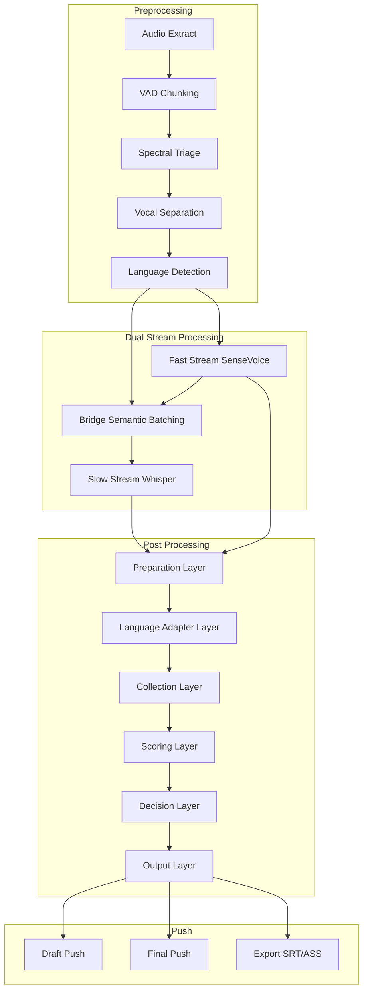

# AnchorFlux

> **Modern Visual Subtitle Workstation Powered by Dual-Engine AI Architecture.**

> Say goodbye to command lines and boring text proofreading. Let AI handle the heavy lifting, so you can focus on the art of creation.

[](README.md)


AnchorFlux is not just another high-precision transcription script; it is a full-stack subtitle production solution tailored for video creators and developers.

<a href="https://www.bilibili.com/video/BV1xAqzB5EFN"></a>
<a href="https://www.bilibili.com/video/BV1ejvCBPEz9"></a>

## Features

### Core Features

- **Dual-Modal Alignment**: SenseVoice + Whisper collaborative work
- **Fast-Slow Dual Stream**: Draft displayed quickly, finalized output completed in background with automatic replacement
- **Spatiotemporal Decoupling**: Subtitle text and timestamps processed separately, leveraging strengths of each
- **Intelligent Vocal Separation**: Demucs on-demand processing to improve recognition quality
- **Word-Level Timestamps**: CTC precise boundary detection, word-level time alignment
- **Clean and Efficient Editor**: Designed specifically for video editors, beautiful interface, convenient operation

### Editor Features

- **Real-time Subtitle Overlay Preview**: Built-in video player with real-time subtitle overlay rendering, what you see is what you get
- **High-precision Waveform Visualization**: Audio waveform rendering based on WaveSurfer.js, intuitively displaying speech activity and silent intervals
- **Intuitive Subtitle Range Editing**: Visual "subtitle range boxes" on the waveform, supporting direct mouse drag at edges to quickly adjust subtitle start and end times
- **Interactive Subtitle List**: Complete subtitle editing panel, support clicking subtitle items to jump to corresponding video progress with one click, support freely modifying text content and timestamps, support quickly inserting new subtitles or deleting existing ones
- **Precise Subtitle Splitting**: Quick split functionality based on waveform timeline points or text cursor position
- **One-Click Multi-Format Export**: Export subtitles to SRT, ASS, VTT standard subtitle formats and plain text files with one click
- **History and Auto-Save**: Support undo and redo, all modifications automatically saved in real-time, no worry about data loss

### User Interface

- **Modern Web UI**: Responsive interface based on Vue.js 3
- **Real-time Dual Stream Preview**: Draft in italic, finalized in regular, status at a glance
- **Drag-and-Drop Upload**: Support drag-and-drop upload of various video formats
- **Real-time Progress Push**: Server-sent events stream, automatic reconnection on disconnect, real-time transcription progress updates

### Technical Features

- **Frontend-Backend Separation**: Vue.js + FastAPI architecture
- **Pipeline Decoupling**: Single responsibility principle, each module focuses on one thing
- **VRAM Adaptive**: Dynamically adjust processing strategy based on GPU memory
- **CPU-Specific Optimization**: Using ONNX quantized models, pure CPU inference speed still impressive
- **Resume from Breakpoint**: Tasks can resume from breakpoint after interruption

### Extended Features (Planned)

- **LLM Proofreading**: Large language model semantic proofreading [Not Implemented]
- **LLM Translation**: Multi-language subtitle translation, directly generate bilingual subtitles [Not Implemented]

## System Requirements

### Basic Requirements
- **OS:** Windows 10/11
- **GPU:** NVIDIA GPU supporting CUDA 12.8+ (at least 4GB VRAM recommended for best performance)
- **Memory:** 16GB+ recommended

## Quick Start

### Integrated Package
1. **Download integrated package from release or provided cloud storage**
2. **Extract, double-click One-Click Start.bat**
3. **Wait for automatic dependency download to complete (maintain network connectivity, takes 10-20 minutes)**
4. **Will automatically start and jump to browser page after completion**
5. **Use One-Click Start.bat for next startup**

### Switching Whisper Models

**Method 1: Auto-download via Configuration (Recommended)**

Edit the `.env` file in the project root, modify the `WHISPER_MODEL` parameter and restart the service. The system will automatically download the model from HuggingFace:
```bash
WHISPER_MODEL=large-v3  # Options: tiny, base, small, medium, large-v3, turbo
```

**Method 2: Manual Download**

Download Faster-Whisper model files from HuggingFace and place them in the specified directory:

1. Visit the model repository (e.g., large-v3): https://huggingface.co/Systran/faster-whisper-large-v3
2. Download the following required files:
   - `model.bin` - Model weights (required)
   - `config.json` - Model configuration (required)
   - `tokenizer.json` - Tokenizer (required)
   - `vocabulary.txt` or `vocabulary.json` - Vocabulary (required)
3. Create the following path in the project directory and place the files:
   ```
   backend/models/huggingface/models--Systran--faster-whisper-large-v3/snapshots/<any-hash-name>/
   ├── model.bin
   ├── config.json
   ├── tokenizer.json
   └── vocabulary.txt
   ```
   > Tip: `<any-hash-name>` can be any string, such as `main` or `v1`

### Runtime Modes

The system supports two runtime modes, switched via the `DEV_MODE` parameter in the `.env` file:

| Mode | DEV_MODE | Frontend | Backend | Access URL |
|------|----------|----------|---------|------------|
| **Production** | `false` (default) | Pre-built static files hosted by backend | Port 8000 | http://localhost:8000 |
| **Development** | `true` | `npm run dev` with hot reload (Port 5173) | Port 8000 | http://localhost:5173 |

- **Production Mode**: Frontend uses pre-built files from `frontend/dist`, served by FastAPI static file hosting, suitable for daily use
- **Development Mode**: Frontend uses Vite dev server with hot reload, suitable for development and debugging

## Technology Stack

### Backend

* **FastAPI** - Async core, providing high-performance streaming interface
* **PyTorch** - Deep learning framework
* **Uvicorn** - ASGI server
* **SSE** - Real-time transmission, streaming push of recognition results

### Frontend

* **Vue 3 / Vite** - Reactive framework
* **WaveSurfer.js** - Waveform visualization
* **Pinia** - State management
* **Element Plus** - Interactive components, dark mode adapted
* **EventSource** - Auto-reconnection, ensuring stable streaming communication

### AI Models

* **Whisper** - Semantic recognition, contextual understanding
* **SenseVoice** - Time anchoring, CTC word-level timestamps
* **Silero VAD** - Voice activity detection, smart accumulation segmentation
* **Demucs** - Vocal separation, eliminating background noise
* **YAMNet** - Audio event classification, spectral triage decision
* **SpeechBrain** - Language detection, multilingual recognition

## Architecture Overview



## Core Architecture

The system adopts the "spatiotemporal decoupling" philosophy, separating the definition of time boundaries from the generation of semantic content, and achieving high-quality subtitle output through a unified preparation-plus-four-layer pipeline.

### 1. Dual-Anchor Mechanism

* **Time Anchor (SenseVoice):** Utilizes SenseVoice model (ONNX quantized inference) running on CPU, using CTC decoding to generate high-precision word-level timestamps, defining the absolute time boundaries of subtitles.
* **Content Anchor (Whisper):** Utilizes Whisper model running on GPU, focusing on semantic coherence and contextual understanding, mapping semantic text to time anchors through the Collection-layer alignment path.

### 2. Asynchronous Dual-Stream Pipeline

The system adopts a three-level pipeline architecture with "out-of-order execution, in-order submission":

* **Fast Stream (FastWorker):** Executes SenseVoice inference concurrently on CPU, pushes draft subtitles via SSE for instant preview.
* **Bridge Semantic Batching:** Aggregates semantic sentences from fast stream into Whisper batches, triggers flush on language switch, speaker switch, pause timeout, etc., improving GPU efficiency and enhancing context consistency.
* **Slow Stream (SlowWorker):** Executes Whisper inference sequentially on GPU, maintains audio context to ensure semantic coherence.

### 3. Unified Preparation + Four-Layer Post-Processing Architecture

* **Preparation Layer:** Merges fast/slow outputs, performs normalization, text arbitration, punctuation pre-processing, and policy snapshot compilation into one canonical input
* **Language Adapter Layer:** Builds a read-only policy snapshot from language cues, centralizing thresholds, continuation words, sentence-end rules, and cross-chunk carry rules
* **Collection Layer:** Aligns text with timeline facts, applies gap repair and monotonic-time constraints, and outputs verifiable alignment results
* **Scoring Layer:** Injects punctuation and applies quality gates without changing timestamps, blocking low-coverage injection from propagating downstream
* **Decision Layer:** Executes soft-cut planning, boundary guards, and sentence-level finalization under one decision path
* **Output Layer:** Handles formatting, distribution, and persistence, then publishes finalized subtitles and export payloads

## Key Technical Features

### Smart Accumulation VAD

To address Whisper's attention decay in long audio segments, the system implements a smart accumulation algorithm based on Silero VAD.

* **Backtrack Breakpoint:** Backtracks to find optimal breakpoint when approaching soft limit, selecting position with largest gap and lowest RMS
* **RMS Validation:** Rejects segmentation at high-energy (speaking) positions, avoiding word truncation
* **Dual Constraints:** 12-second soft limit (SenseVoice's optimal processing duration) + 30-second hard limit (physical input window)

### Audio Precheck and Smart Probe

Before processing, audio blocks undergo multi-layer audio precheck analysis to determine if vocal separation is needed.

* **DNSMOS Three-Layer Decision:** Uses DNSMOS metrics for speech quality evaluation. Layer 1 for fast screening (pass high-quality/separate low-quality), Layer 2 for spectral feature supplementary judgment, Layer 3 for YAMNet semantic classification fallback.
* **Smart Probe Mode:** Center-out exponential probe strategy for quickly determining if full detection is needed. Pure videos are directly marked as no separation needed; if interference is detected, falls back to standard precheck mode.
* **On-Demand Separation:** Separates only audio blocks marked by audio precheck, saving GPU resources compared to global track separation.

### Preparation-Layer Text Arbitration

A quality-signal-driven text selection mechanism that produces one chosen text track before the four-layer pipeline, preventing low-quality content from leaking into downstream stages.

* **Quality Signals:** Confidence, length ratio, repetition detection, hallucination detection, and ITN fallback markers
* **Decision Logic:** Automatically falls back to the fast stream when the slow stream shows repetition, hallucination, or abnormal length patterns, while emitting reusable arbitration diagnostics

### Collection-Layer Time Alignment

The core mechanism that maps slow-stream semantic text onto fast-stream time anchors and establishes timeline facts for downstream stages.

* **Global Sequence Alignment:** Handles insertions, deletions, and substitutions over a unified word stream
* **Gap Repair and Monotonic Constraints:** Repairs alignment gaps and enforces monotonic timestamps to avoid word-level time rollback
* **Coverage Gating:** Tracks alignment coverage and gap ratio in real time, and triggers degradation when quality falls below threshold

## Configuration Options

### Port Configuration
```python
# Modify in launcher
backend_port = 8000      # Backend port
frontend_port = 5173     # Frontend port
```

### Environment Variables

Customize system settings by editing the `.env` file in the project root. Restart the service after modifications.

| Variable | Options | Default | Description |
|----------|---------|---------|-------------|
| `DEV_MODE` | `true` / `false` | `false` | Development mode, enables frontend dev server and DEBUG logs |
| `WHISPER_MODEL` | `tiny` / `base` / `small` / `medium` / `large-v3` / `turbo` | `medium` | Whisper model size, affects accuracy and VRAM usage |
| `WHISPER_COMPUTE_TYPE` | `auto` / `int8` / `int8_float16` / `float16` | `auto` | Inference precision, auto selects based on available VRAM |
| `SENSEVOICE_DEVICE` | `cpu` / `cuda` / `auto` | `cpu` | SenseVoice inference device |
| `SENSEVOICE_MODEL_TYPE` | `quantized` / `fp32` | `quantized` | SenseVoice model type, quantized only supports CPU |
| `USE_HF_MIRROR` | `true` / `false` | `true` | Use HuggingFace China mirror |
| `PYPI_MIRROR` | Mirror URL or empty | Tsinghua | Python package download mirror |

## Version History

- **v3.0.0** (In Development) - Dual-modal spatiotemporal decoupled architecture, fast-slow dual stream experience
- **v2.0.0** (2025-08-18) - Complete architecture upgrade, frontend-backend separation
- **v1.1.0** (2025-06-18) - Initial version, command line interface

## Contributing

1. Fork the project
2. Create feature branch: `git checkout -b feature/AmazingFeature`
3. Commit changes: `git commit -m 'Add some AmazingFeature'`
4. Push branch: `git push origin feature/AmazingFeature`
5. Open Pull Request

## License

This project is open source under the MIT License - see [LICENSE](LICENSE) file for details

## Disclaimer

> This tool is for learning and research purposes only, commercial use in any form is prohibited.
> Users must comply with relevant laws and regulations, the author assumes no responsibility for usage consequences.

## Acknowledgments

- [OpenAI Whisper](https://github.com/openai/whisper) - Semantic recognition core
- [SenseVoice](https://github.com/FunAudioLLM/SenseVoice) - Time anchoring core
- [Silero VAD](https://github.com/snakers4/silero-vad) - Voice activity detection
- [Demucs](https://github.com/facebookresearch/demucs) - Vocal separation
- [FastAPI](https://fastapi.tiangolo.com/) - Modern web framework
- [Vue.js](https://vuejs.org/) - Frontend framework
- All contributors of open source libraries

---

**If this project helps you, please give a Star for support!**
