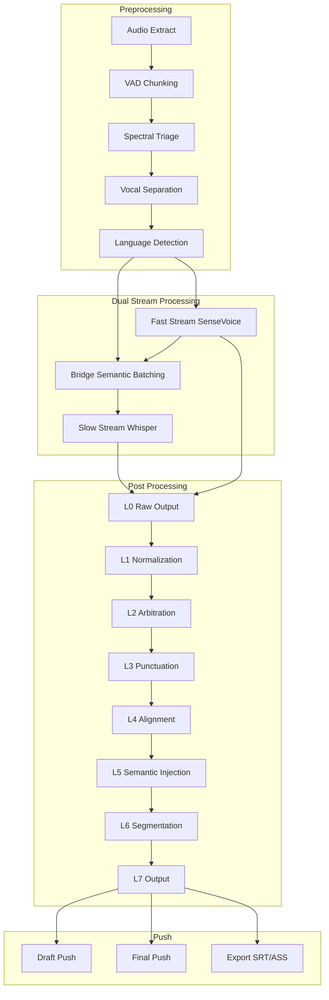

# Video to Subtitle System Architecture Flowchart (English)

```mermaid
flowchart TB
    subgraph Preprocessing
        A[Audio Extract] --> B[VAD Chunking]
        B --> C[Spectral Triage]
        C --> D[Vocal Separation]
        D --> E[Language Detection]
    end

    subgraph Dual Stream Processing
        E --> F[Fast Stream SenseVoice]
        E --> G[Bridge Semantic Batching]
        F --> G
        G --> H[Slow Stream Whisper]
    end

    H --> L0
    F --> L0

    subgraph Post Processing
        L0[L0 Raw Output] --> L1[L1 Normalization]
        L1 --> L2[L2 Arbitration]
        L2 --> L3[L3 Punctuation]
        L3 --> L4[L4 Alignment]
        L4 --> L5[L5 Semantic Injection]
        L5 --> L6[L6 Segmentation]
        L6 --> L7[L7 Output]
    end

    subgraph Push
        K[Draft Push]
        L[Final Push]
        M[Export SRT/ASS]
    end

    L7 --> K
    L7 --> L
    L7 --> M
```
