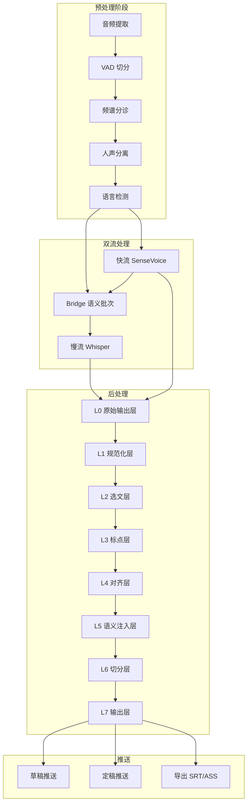

# 视频转字幕系统架构流程图（中文版）

```mermaid
flowchart TB
    subgraph 预处理阶段
        A[音频提取] --> B[VAD 切分]
        B --> C[频谱分诊]
        C --> D[人声分离]
        D --> E[语言检测]
    end

    subgraph 双流处理
        E --> F[快流 SenseVoice]
        E --> G[Bridge 语义批次]
        F --> G
        G --> H[慢流 Whisper]
    end

    H --> L0
    F --> L0

    subgraph 后处理
        L0[L0 原始输出层] --> L1[L1 规范化层]
        L1 --> L2[L2 选文层]
        L2 --> L3[L3 标点层]
        L3 --> L4[L4 对齐层]
        L4 --> L5[L5 语义注入层]
        L5 --> L6[L6 切分层]
        L6 --> L7[L7 输出层]
    end

    subgraph 推送
        K[草稿推送]
        L[定稿推送]
        M[导出 SRT/ASS]
    end

    L7 --> K
    L7 --> L
    L7 --> M
```
